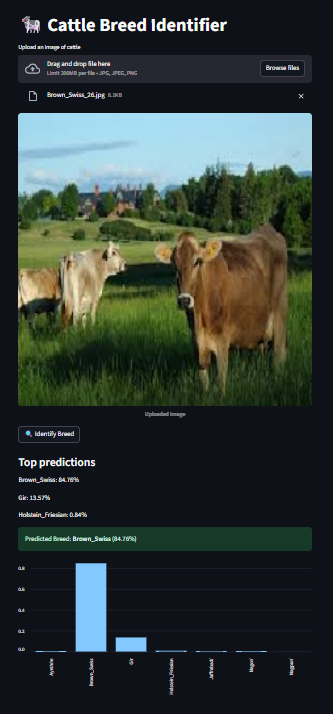

# 🐄 Cattle Breed Identification

A deep learning project that identifies cattle breeds from images using a Convolutional Neural Network (MobileNetV2) and provides useful breed information.
The project also includes a Streamlit frontend where you can upload an image and get instant predictions.

## 🐂 Supported Breeds

- Ayrshire
- Gir
- Holstein Friesian
- Brown Swiss
- Nagpuri
- Nagori
- Jaffrabadi

## 📸 Demo

